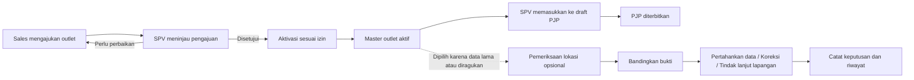

# Audit pendaftaran, master outlet, dan pemeriksaan lokasi opsional

Tanggal: 9 Oktober 2026. Status: perombakan diterapkan pada aplikasi dan database lokal. Bagian temuan di bawah mendokumentasikan kondisi sebelum perombakan; status implementasi dan bukti verifikasi tersedia di bagian akhir.

## Batas bisnis yang menjadi acuan

- Pendaftaran utama menghasilkan outlet aktif melalui pemeriksaan pengajuan dan aktivasi. Tidak perlu lolos pencarian Google atau pemeriksaan lokasi opsional.
- Pemeriksaan lokasi dipakai atas pilihan pengguna: merapikan database lama atau memeriksa data baru yang diragukan. Outlet yang belum diperiksa bukan otomatis bermasalah atau tertunda aktivasinya.
- Kelengkapan input, izin peran, koordinat yang benar-benar diisi, dan pencegahan duplikasi adalah pemeriksaan dasar alur utama. Ini berbeda dari membandingkan outlet dengan peta eksternal.
- Status pemeriksaan peta tidak boleh otomatis mengunci presensi, menonaktifkan outlet, menolak order, atau menghalangi PJP. Perubahan koordinat tetap memengaruhi perhitungan radius presensi sehingga harus dikendalikan.
- Stok dan transaksi pembayaran berada di luar lingkup. Informasi pembayaran yang relevan tetap sebatas catatan bisnis opsional.

## Kesimpulan

Masalah utama berada pada makna hasil validasi: skor gabungan saat ini dapat menafsirkan ketiadaan bukti sebagai kesalahan, sekaligus menutupi pertentangan antarhasil. UI kemudian menyajikannya sebagai persentase akurasi dan keputusan koreksi. Mengganti warna atau menyesuaikan bobot saja tidak cukup.

Alur pendaftaran dan master juga belum utuh: masih ada pemanggilan pemeriksaan Google otomatis, koordinat kosong berubah menjadi nol, pengelolaan NIK tidak tersambung, serta perbedaan aturan koreksi antara halaman master dan halaman validasi.

## Metode dan bukti pengujian

Audit menelusuri schema request, service, model Prisma, halaman React, dan pemakaian outlet oleh planner/presensi. Fungsi validasi asli dijalankan dengan mock respons HTTP dan mock Prisma dalam proses terpisah. Tidak ada pemanggilan Google nyata atau perubahan database bisnis.

| Skenario simulasi | Hasil implementasi saat ini | Penilaian |
|---|---|---|
| Semua pencarian mengembalikan ZERO_RESULTS | SUSPECT, skor 0; UI: Perlu koreksi | Bukti tidak tersedia diperlakukan sebagai kesalahan |
| Alamat dan titik sesuai, profil toko tidak ditemukan | LIKELY_VALID, skor 50 | Keberadaan di direktori peta mengurangi skor meskipun alamat konsisten |
| Reverse, nama tempat, dan nearby cocok; forward geocode berjarak sekitar 89 km | VALID, skor 75, tanpa peringatan | Konflik alamat tidak ditampilkan sebagai konflik |
| Profil yang cocok berstatus CLOSED_PERMANENTLY | VALID, skor 100, tanpa peringatan | Indikasi tutup dari penyedia diabaikan; seharusnya bahan tinjauan, bukan otomatis menonaktifkan outlet |
| Kandidat nama cocok berjarak 801 m, konfigurasi batas suspect 500 m | WARNING, skor 93, tetap menjadi rekomendasi koordinat | Cabang fallback saran memakai batas 1.000 m dan melewati batas konfigurasi |
| Request pendaftaran tanpa latitude/longitude | Schema menghasilkan 0,0 | Data tidak tersedia berubah menjadi koordinat yang tampak terisi |
| Request edit master berisi data NIK | Hanya ownerName diteruskan schema | taxNumber/taxType/taxAddress dibuang |
| Request aktivasi berisi koreksi koordinat | Koordinat dibuang schema | Dukungan override di service tidak dapat digunakan lewat endpoint |
| Penyedia mengembalikan REQUEST_DENIED | HTTP 503, tidak menyimpan hasil | Perlindungan yang sudah benar |
| Outlet berubah ketika validasi berjalan | HTTP 409 pada penyimpanan hasil | Perlindungan konflik yang sudah benar untuk jalur validasi lengkap |
| Radius negatif, sangat besar, atau pecahan | Lolos schema request | Tidak sesuai kebutuhan radius presensi; pecahan juga tidak sesuai kolom Int |

Uji yang sudah ada, `node --test --test-reporter=dot tests/validation.test.js`, lulus. Cakupannya terutama schema dasar dan fungsi skor terpisah; kelulusan tersebut belum menjamin keputusan akhir orkestrator benar.

Penilaian UI pada audit ini berdasarkan kode dan alur interaksi. Tampilan browser, ukuran aktual, kontras, dan perilaku perangkat belum diverifikasi secara visual.

## A. Logika pemeriksaan lokasi opsional

### A1 — P1: Tidak ditemukan bukan berarti perlu koreksi

`server/src/modules/outlets/services/validate-outlet.service.js:155` membedakan kegagalan penyedia dari ZERO_RESULTS, tetapi hasil kosong kemudian mendapat skor nol dan masuk rata-rata. Pada baris 195–198, skor rendah menjadi SUSPECT. `client/src/pages/OutletValidation/components/OutletValidationPanel.jsx:24` menerjemahkannya menjadi “Perlu koreksi”.

Perbaikan: pisahkan MATCH, CONFLICT, NO_EVIDENCE, AMBIGUOUS, dan ERROR per jenis bukti. Hasil tanpa bukti menjadi “Bukti peta belum cukup”, tanpa kewajiban mengoreksi master.

### A2 — P1: Konflik antarhasil tertutup rata-rata

`validate-outlet.service.js:170` memilih satu jarak: Find Place diutamakan, lalu forward geocode. Jika tempat ditemukan dekat tetapi alamat tertulis menunjuk jauh, peringatan hanya mengikuti tempat dekat. Empat skor digabung tanpa aturan khusus untuk pertentangan material.

Perbaikan: simpan jarak dan kesimpulan masing-masing bukti. Konflik alamat, wilayah, identitas cabang, atau koordinat memicu tinjauan terlepas dari skor agregat. Ketidakpastian penyedia tetap harus dijelaskan; konflik bukan keputusan bahwa master pasti salah.

### A3 — P1: Sumber pencocokan saling bergantung

`outlet-validation.helpers.js:238` mencari Find Place melalui nearby berbasis nama lebih dahulu; pemeriksaan nearby lain memakai lokasi yang sama. Keduanya dapat memberi nilai tinggi atas tempat yang sama. Selain itu, `clean-address-for-search.service.js` menambahkan wilayah dari reverse geocode titik yang sedang diuji ke alamat pendek. Titik yang salah dapat ikut mengarahkan hasil pencarian ke sekitar titik itu sendiri.

Perbaikan: bedakan bukti independen dari hasil yang memakai bias titik master. Gunakan wilayah alamat/penugasan yang diketahui sebagai pembanding terpisah. Simpan asal query, bias lokasi, placeId, dan tingkat ketelitian. Jangan menghitung dua hasil untuk placeId yang sama sebagai dua konfirmasi independen.

### A4 — P1: Pemilihan kandidat belum menilai ambiguitas dan ketelitian

`outlet-validation.helpers.js:220` memilih hasil geocode pertama; baris 302 memilih kandidat Find Place pertama. Metadata `location_type` dan `partial_match` tidak diteruskan. Nearby memilih kesamaan nama tertinggi, tanpa membandingkan kekuatan kandidat pertama dengan kedua. `score-find-place.service.js` menyimpan businessStatus tetapi tidak memakainya untuk peringatan.

Perbaikan: bandingkan kandidat berdasarkan nama, cabang, alamat, wilayah, dan jarak; simpan kandidat alternatif yang layak. Titik wilayah/jalan dan hasil parsial tidak dianggap posisi bangunan yang presisi. Nama generik, cabang berdekatan, dan status tutup perlu tinjauan manusia.

### A5 — P1: Rekomendasi koordinat tidak mengikuti satu aturan

`validate-outlet.service.js:220` menggunakan batas dinamis, tetapi baris 231 menyediakan fallback sampai 1.000 m. Simulasi menghasilkan saran perpindahan 801 m meski batas suspect 500 m.

Perbaikan: satu kebijakan pemilihan kandidat untuk seluruh cabang. Saran adalah kandidat pembanding. Tampilkan titik lama, kandidat, selisih jarak, alasan cocok, konflik, dan sumber sebelum pengguna mengusulkan koreksi. Tidak ada perpindahan otomatis.

### A6 — P1: Riwayat dan aturan koreksi dapat dilewati

`correct-coordinates.service.js:13` menyimpan aktor, alasan, previous/next, dan memakai updatedAt. Namun `update-outlet.service.js:17` menerima perubahan koordinat melalui edit biasa tanpa menambahkan riwayat koreksi atau memeriksa versi request. Impor RJP juga dapat memperbarui koordinat tanpa menambah entri koreksi.

Jalur koreksi khusus tidak menghapus `clusterRoute` yang memakai koordinat lama, sedangkan edit master melakukannya. Riwayat hasil pemeriksaan juga ditimpa pada pemeriksaan berikutnya; koreksi menghapus hasil lama dan hanya mempertahankan coordinateHistory.

Perbaikan: satu service perubahan lokasi untuk master, koreksi, dan impor. Wajib ada sumber, alasan, aktor, versi data, nilai sebelum/sesudah, serta penanganan rute referensi yang menjadi usang. Tinjau dampak terhadap kunjungan aktif tanpa mengubah bukti presensi historis. Simpan setiap hasil pemeriksaan dan keputusan sebagai riwayat terpisah.

### A7 — P2: Pemeriksaan belum menjadi pekerjaan yang dapat diselesaikan

Data saat ini berpusat pada validationStatus/confidence/details terakhir. Belum ada alasan pemeriksaan, penanggung jawab, keputusan “data master sudah benar”, atau tindak lanjut lapangan. Koreksi mengembalikan status UNVALIDATED sehingga pekerjaan yang selesai dapat tampak belum dikerjakan.

Perbaikan: buat kasus pemeriksaan hanya saat dipilih/diajukan. Kasus memiliki alasan, pelaksana, status pekerjaan, bukti, keputusan, dan waktu penyelesaian. Mempertahankan data master dengan alasan yang sah adalah keputusan akhir yang valid, termasuk ketika toko tidak tercantum di peta.

### A8 — P2: Batch belum cocok untuk pembersihan data lama

`batch-validate-outlets.service.js` mengambil maksimal 100 outlet berdasarkan updatedAt terbaru. Filter yang tidak dikenal diabaikan; daftar ID kosong dapat kembali memilih seluruh pool sesuai batas. NEEDS_REVIEW memasukkan UNVALIDATED tetapi tidak INCOMPLETE. Tidak ada job/cursor persisten atau resume, dan output “success” berarti proses berhasil dijalankan, bukan outlet sesuai.

Perbaikan: batch hanya untuk cakupan yang dipilih secara eksplisit; enum filter ketat; daftar kosong tidak memperluas cakupan. Tampilkan pratinjau jumlah, progres per outlet, hasil berhasil/gagal, dan retry hanya kegagalan. Jangan memasukkan seluruh outlet belum diperiksa ke antrean wajib. Prioritaskan ini setelah keputusan validasi tunggal benar.

### A9 — P1: Izin fitur dan cakupan data belum konsisten untuk peran yang diberi izin tambahan

`authorizeWithPermission` mengizinkan peran lain bila can_validate_outlet bernilai true. Namun batch dan ringkasan hanya membatasi cakupan apabila role tepat SUPERVISOR. Sales yang diberi izin tersebut dapat lolos middleware, lalu batch tanpa ID memakai `{deletedAt:null}` tanpa pembatas penugasan. Ini dikonfirmasi dengan mock middleware dan query Prisma; bukan dugaan berdasarkan menu. Peran Driver/Kepala Gudang juga memiliki pengecualian pada middleware parameter outlet, sehingga izin tambahan harus ditinjau bersama cakupan objek.

Perbaikan: izin untuk memakai fitur dan izin atas outlet tertentu diuji bersama untuk daftar, ringkasan, batch, detail, dan mutasi. Gunakan satu aturan scope server, termasuk peran kustom. Izin tambahan tidak boleh otomatis berarti akses global. Tambahkan uji lintas tim dan peran dengan izin tambahan.

### A10 — P2: Nearby terpisah menghasilkan dua versi bukti

Validasi lengkap menyimpan nearby dalam `validationDetails.signals.nearbySearch`. Endpoint validateNearby menyimpan hasil baru ke `validationDetails.nearbySearch`, tanpa mengganti sinyal tersebut, tanpa memperbarui tanggal hasil atau menghitung kembali kesimpulan. Detail UI membaca signals sehingga dapat tetap menampilkan bukti lama. Ini belum memicu salah status baru, tetapi kontraknya membingungkan bila endpoint dipakai.

Perbaikan: pemeriksaan parsial menghasilkan run tersendiri, dengan sumber dan waktu, lalu dipresentasikan sebagai bukti parsial. Jangan mencampur run berbeda menjadi satu hasil validasi lengkap. Hapus endpoint bila tidak ada kebutuhan produk yang jelas, setelah memastikan tidak ada pemakai lain.

## B. Alur utama pendaftaran dan master outlet

### B1 — P1: Pendaftaran masih terikat pemeriksaan eksternal otomatis

`create-registration.service.js:32` selalu memanggil validateGooglePlace. Helper itu memakai query berakhiran “Cimahi Bandung”, baseline skor 50, dan fetch tanpa timeout eksplisit. Kegagalan tertangkap dan bukan syarat status approval, tetapi submit tetap menunggu panggilan eksternal. Data placeDetails dari request juga didahulukan atas hasil pemeriksaan server.

Perbaikan: hapus pemeriksaan kualitas outlet otomatis dari submit utama. Pencarian alamat/profil boleh tetap menjadi bantuan pengisian yang dipilih pengguna, dengan sumber yang jelas, tanpa klaim sudah diverifikasi dan tanpa syarat keberhasilan Google.

### B2 — P1: Koordinat bawaan menyamarkan input yang hilang

`customer-registrations.schema.js:30` mengubah koordinat tidak dikirim menjadi nol dan belum memberi batas geografis. Aktivasi hanya menguji nilai terisi, finite, dan rentang, sehingga 0,0 hasil default dapat lolos. UI master juga mengisi titik Bandung dan memilih klaster pertama sebagai fallback (`OutletManagementPage.jsx:84,172`).

Perbaikan: koordinat belum diisi harus tetap kosong. Tolak koordinat hilang/rusak saat aktivasi; jangan melarang semua nilai nol karena lintang nol adalah nilai geografis yang sah. Simpan sumber, waktu, dan akurasi GPS jika tersedia. Klaster harus dipilih eksplisit. Bantuan lokasi perangkat harus menjelaskan apakah pengguna sedang berada di toko.

### B3 — P1: Pengelolaan NIK belum tersambung ke sumber data

`NikManagementModal.jsx:61` mengirim data pajak ke endpoint outlet, sedangkan schema update hanya mempertahankan ownerName dari payload tersebut. Model Outlet tidak memiliki kolom-kolom NIK/pajak. Pada daftar registrasi, modal memanggil `customerRegistrationsApi.update`, tetapi fungsi dan route update tersebut belum tersedia. Akibatnya master dapat menampilkan sukses tanpa menyimpan NIK; jalur registrasi gagal.

Perbaikan: tentukan satu sumber identitas/legalitas yang ditautkan ke outlet, lengkapi kontrak baca/tulis dan izin, lalu uji simpan–muat ulang–ekspor. Jangan menambah form tanpa penyimpanan yang benar.

### B4 — P1: Hubungan pengajuan–master dan duplikasi belum kuat

CustomerRegistration belum memiliki relasi outletId; keterkaitan banyak bergantung pada kode bisnis. Aktivasi menyimpan klaster terpilih pada Outlet, tetapi tidak memperbarui clusterId pengajuan jika berbeda. Belum ada pemeriksaan kemiripan outlet fisik pada create/aktivasi; kode unik saja tidak mencegah toko yang sama mendapat dua kode. Submit juga tidak memakai requestId untuk retry.

Perbaikan: simpan relasi eksplisit registration–outlet, pisahkan snapshot pengajuan dari data aktif, dan tampilkan keduanya dengan label. Beri kandidat duplikat berdasarkan kombinasi kode, nama, alamat, kontak, serta kedekatan titik; jangan memblokir hanya karena nama/pemilik sama. Retry submit memakai identitas request stabil.

Aktivasi saat ini menyiarkan event outlet tetapi tidak memanggil invalidasi cache master atau sinkronisasi outletCount seperti jalur createOutlet. Cache Admin dapat tetap berisi daftar lama sampai kedaluwarsa. Satukan penyelesaian aktivasi dengan aturan create master yang relevan.

### B5 — P2: Approval, aktivasi, dan penjadwalan tidak disajikan sebagai rangkaian jelas

Approval berada di halaman persetujuan; aktivasi ada di laporan pendaftaran. UI mengatakan “Menunggu Aktivasi Admin” meski server mengizinkan Admin dan Supervisor. Admin masih mendapat tombol Setujui pada SPV_APPROVED yang akan ditolak service. Pengajuan ditolak belum memiliki jalur revisi/resubmit pada record yang sama.

Jadwal pendaftaran memakai WEEK_GANJIL/WEEK_GENAP/ALL_WEEK dan tersimpan sebagai visitSchedule. Planner baru membaca itineraryCode dan aturan interval bertanggal. Preferensi kunjungan dari pengajuan belum menjadi aturan planner secara otomatis.

Perbaikan: satu antrean dengan tahap pengajuan → tinjauan → siap aktivasi → aktif. Aksi mengikuti status dan izin aktual. Sediakan pengembalian untuk revisi tanpa membuat pengajuan duplikat. Preferensi Sales ditampilkan kepada SPV sebagai usulan hari/interval F1/F2/F4; SPV memasukkannya ke draft planner dengan tanggal jangkar, lalu menerbitkan secara eksplisit. Outlet aktif tidak berarti sudah terjadwal.

### B6 — P1: Penonaktifan belum menampilkan dampak dan dapat memberi sukses palsu

`OutletManagementPage.jsx:122` langsung menghapus baris dan menampilkan sukses sebelum API selesai. Kegagalan hanya masuk console. Service delete melakukan soft-delete dan membersihkan rute, tetapi belum meninjau PJP mendatang/kunjungan aktif/dokumen yang masih berjalan. Presensi PJP membaca outlet terkait dan belum memeriksa deletedAt pada jalur yang diaudit.

Perbaikan: tindakan “Nonaktifkan” dengan alasan, pemeriksaan dampak, dan keputusan untuk pekerjaan berjalan. Tampilkan sukses setelah server berhasil. Riwayat dokumen harus tetap dapat dibaca; jangan menghapus hubungan historis.

## C. Temuan UI/UX konkret

1. **Daftar master terpotong diam-diam.** `OutletDirectory.jsx:54` memakai slice(0,50) tanpa pagination, sementara teks jumlah mengklaim seluruh hasil. Nama outlet membuka Google Maps, belum membuka profil outlet di aplikasi.
2. **Angka ringkasan tidak sesuai hasil klik.** Ringkasan “Sesuai peta” menghitung VALID + LIKELY_VALID tetapi klik hanya VALID. “Perlu tinjauan” menghitung WARNING + SUSPECT tetapi klik hanya WARNING. INCOMPLETE masuk hitungan belum diperiksa, namun tidak muncul saat filter UNVALIDATED diklik.
3. **Bukti yang dibutuhkan justru hilang.** Detail membaca s.formattedAddress, sedangkan service menyimpan googleAddress. Riwayat membaca h.latitude/h.longitude, sedangkan server menyimpan previous/next. Nama kandidat, konflik, dan pelaku perubahan belum disajikan cukup untuk membuat keputusan.
4. **Hierarki halaman tidak mendukung pekerjaan pemeriksa.** Peta di setiap card, enam ringkasan, kontrol GT/MT berulang, kontak dan pembayaran memenuhi daftar. Penyebab masalah dan langkah berikutnya kurang menonjol. Skor disebut “Akurasi Peta” walaupun hanyalah formula pencocokan internal.
5. **Informasi fallback menyesatkan.** Review pengajuan tanpa placeDetails menambahkan rating 5, jam buka, dan nomor telepon contoh (`OutletApprovalReviewModal.jsx:104`). Card dapat menampilkan nilai itu sebagai profil tempat. Fallback klaster master juga menggunakan nama klaster tertentu, bukan “Belum tersedia”.
6. **Feedback dan aksesibilitas belum konsisten.** Gagal muat master hanya masuk console; beberapa card filter adalah div onClick tanpa interaksi keyboard. Form koreksi memiliki label yang belum terhubung ke input. Modal master/review pengajuan memakai pola berbeda dari NativeDialog yang dipakai validasi.

## Rancangan alur yang direkomendasikan

Pemeriksaan dasar data dilakukan pada setiap tahap yang relevan. Tidak ada transisi utama yang menunggu hasil Google. Admin dapat memasukkan data master lama lewat jalur yang memang berizin, dengan sumber data dan pemeriksaan duplikasi yang sama.

## Kontrak keputusan validasi baru

Pisahkan tiga hal yang saat ini bercampur:

| Jenis status | Contoh | Makna |
|---|---|---|
| Operasional outlet | Aktif, nonaktif | Boleh dipakai sesuai kebijakan bisnis |
| Pekerjaan pemeriksaan | Tidak diajukan, terbuka, menunggu lapangan, selesai | Siapa perlu melakukan apa |
| Hasil pencocokan peta | Konsisten, bertentangan, ambigu, bukti kurang, layanan gagal | Apa yang benar-benar didukung data eksternal |

Aturan keputusan:

1. Data kosong menghasilkan masalah kelengkapan spesifik; tidak diisi otomatis dengan titik contoh.
2. Kegagalan API menghasilkan “Pemeriksaan belum selesai” dan mempertahankan hasil sebelumnya beserta tanggalnya. Hasil lama tidak ditampilkan sebagai hasil pemeriksaan yang baru gagal.
3. ZERO_RESULTS menghasilkan “Bukti peta belum cukup”. Tidak menuntut koreksi.
4. Kandidat tunggal kuat dengan alamat/wilayah/titik konsisten menghasilkan “Data konsisten dengan peta”. Ini bukan bukti absolut keberadaan fisik.
5. Konflik material dan kandidat ambigu mengharuskan tinjauan jika kasus ingin diselesaikan, tidak memblokir operasional secara otomatis.
6. Kandidat berstatus tutup menambah peringatan bersumber dan bertanggal; tidak otomatis menonaktifkan outlet.
7. Pemeriksa boleh mempertahankan master berdasarkan bukti lapangan atau sumber data yang dapat dijelaskan. Simpan alasan dan lampiran/referensi jika tersedia.
8. Koreksi melalui satu service terkontrol dengan versi dan dampak. Perubahan master membuat hasil lama ditandai usang, bukan menghapus riwayat.
9. Skor, jika masih diperlukan, bernama “Skor pencocokan” pada detail teknis. Tidak dijadikan persentase akurasi atau satu-satunya dasar keputusan.

## Rancangan halaman desktop dahulu

### Master outlet

- Toolbar tunggal: pencarian, wilayah, status operasional, tambah outlet. Pagination server, jumlah hasil yang akurat, dan urutan yang dapat dipilih.
- Tabel: kode/nama, alamat, wilayah/Sales, status operasional, ringkasan penjadwalan. Pemeriksaan opsional tampil sebagai informasi tambahan, bukan indikator bahwa semua outlet harus diperiksa.
- Klik nama membuka profil outlet; tautan peta menjadi aksi sekunder.
- Profil: identitas/kontak, lokasi dan wilayah, kunjungan/PJP, dokumen terkait, riwayat. Aksi sesuai izin: edit identitas, koreksi lokasi, pindahkan wilayah, ajukan pemeriksaan, nonaktifkan.
- Legalitas/NIK berada pada profil dan sumber data yang benar; tidak mendominasi header master. Pembayaran tetap sekunder.

### Pemeriksaan lokasi opsional

- Judul dan penjelasan singkat menegaskan sifat opsional. Tampilan awal adalah kasus yang memang diajukan; tombol “Pilih outlet untuk diperiksa” menyediakan akses database lama.
- Layout daftar di kiri dan detail kasus di kanan. Daftar memuat outlet, alasan, masalah utama, penanggung jawab, serta hasil/waktu pemeriksaan terakhir.
- Detail memperlihatkan perbandingan data master, kandidat peta, dan bukti lapangan. Peta tunggal memperlihatkan titik-titik pembanding dengan jarak yang jelas.
- Aksi dipisah: “Jalankan pemeriksaan peta”, lalu keputusan “Pertahankan data”, “Koreksi data”, atau “Minta pengecekan lapangan”. Tidak perlu menjalankan ulang Google untuk mencatat keputusan berdasarkan bukti lain.
- Riwayat menampilkan pelaku, alasan, sebelum/sesudah, sumber, dan waktu. Detail teknis skor dapat dibuka bila dibutuhkan.
- Pada layar kecil, daftar dan detail menjadi halaman berurutan dengan kembali yang mempertahankan pencarian/filter, bukan modal panjang bertumpuk.

Gunakan komponen dan token visual aplikasi yang sama dengan perombakan Admin/SPV, tipografi terbaca, satu aksi utama per konteks, jarak konsisten, fokus keyboard terlihat, serta state loading/error/kosong yang berbeda. Hindari membuat sistem styling baru untuk modul ini.

## Urutan implementasi dan kriteria penerimaan

1. **Kebenaran keputusan pemeriksaan:** pisahkan NO_EVIDENCE dari CONFLICT/ERROR, pertahankan konflik antarbukti, metadata kandidat, dan satu aturan rekomendasi. Tambahkan uji orkestrator atas seluruh kasus simulasi di atas.
2. **Integritas perubahan data:** satukan koreksi koordinat, versi request, riwayat, sumber GPS, invalidasi rute, dan batas radius. Uji dua pemeriksa bersamaan serta edit/impor dari jalur lain.
3. **Alur utama:** keluarkan pemeriksaan Google otomatis dari submit, perbaiki koordinat kosong dan klaster default, tautan pengajuan–outlet, retry/duplikasi, NIK, cache aktivasi, serta aksi sesuai tahap. Uji outlet tanpa profil Google tetap dapat aktif dan masuk planner.
4. **Workspace UI:** profil master dan antrean pemeriksaan opsional, pagination, bukti yang terbaca, tindakan yang dapat diselesaikan, feedback yang jujur. Verifikasi desktop, keyboard, lalu mobile.
5. **Batch dan transisi data lama:** setelah validasi tunggal benar, tambahkan proses batch yang bisa dilanjutkan. Hasil lama diberi label metode lama, tidak dikonversi otomatis menjadi keputusan final atau kewajiban pemeriksaan ulang. Jadwal dan bukti historis tetap utuh.

## Pembagian peran yang direkomendasikan

Matriks berikut adalah rancangan, bukan klaim bahwa seluruh izin tersebut sudah diterapkan.

| Tindakan | Sales | Supervisor | Admin |
|---|---|---|---|
| Ajukan outlet baru | Penugasan sendiri | Sesuai izin dan tim | Sesuai izin |
| Tinjau pengajuan | Lihat hasil dan revisi pengajuan sendiri | Tim sendiri | Cakupan yang diizinkan |
| Aktivasi pengajuan yang disetujui | Tidak | Bila diberi izin, tim sendiri | Sesuai izin |
| Ajukan pemeriksaan lokasi opsional | Outlet penugasan, sertakan alasan | Tim sendiri | Cakupan yang diizinkan |
| Lampirkan hasil pengecekan lapangan | Outlet yang ditugaskan untuk diperiksa | Tim sendiri | Cakupan yang diizinkan |
| Putuskan mempertahankan/koreksi master | Tidak melalui pelaporan biasa | Bila berizin, tim sendiri | Sesuai izin |
| Jalankan batch pemeriksaan | Tidak secara default | Pilihan eksplisit dalam tim | Pilihan eksplisit dalam cakupan |
| Memasukkan outlet aktif ke planner | Usulan preferensi kunjungan | Tim sendiri | Sesuai izin perencanaan |

Driver dan Kepala Gudang memperoleh informasi outlet yang diperlukan untuk dokumen/pekerjaan pengiriman. Akses itu tidak otomatis memberi hak mengoreksi master atau memeriksa seluruh database.

## Skenario penerimaan wajib sebelum perombakan dianggap selesai

- Pengajuan tanpa profil Google dapat disetujui, diaktifkan, dan dijadwalkan. Gangguan layanan peta tidak menahan submit utama.
- Outlet lama yang tidak diajukan untuk pemeriksaan tetap aktif sesuai status operasionalnya dan tidak masuk antrean wajib.
- Bukti peta kosong, konflik alamat, kandidat ambigu, status tempat tutup, dan kegagalan layanan menghasilkan penjelasan yang berbeda.
- Pemeriksa dapat menyelesaikan kasus dengan mempertahankan data yang benar, termasuk outlet yang tidak tercantum di peta.
- Koreksi dari master, kasus pemeriksaan, atau impor memiliki sumber dan riwayat yang konsisten. Penyimpanan versi lama ditolak dan rute yang bergantung pada titik diperbarui/ditandai usang.
- Sales/SPV dengan izin tambahan tidak dapat membaca ringkasan atau menjalankan batch atas outlet di luar cakupan.
- Aktivasi muncul pada daftar master dan jumlah outlet wilayah setelah respons berhasil; retry tidak membuat outlet kedua.
- NIK yang disimpan dapat dibaca ulang dan diekspor dari sumber yang sama; kegagalan tidak menampilkan sukses.
- Outlet ke-51 dan seterusnya dapat diakses, jumlah/filter ringkasan sesuai daftar, dan detail menunjukkan nilai koordinat sebelum/sesudah beserta pelakunya.
- Penonaktifan meninjau pekerjaan berjalan; dokumen dan bukti kunjungan historis tetap dapat dibaca.

Selesai berarti pengguna dapat mengetahui apa yang diperiksa, bukti yang mendukung, siapa yang memutuskan, apa yang berubah, serta dampaknya. Label “belum diperiksa” tidak menghambat outlet yang sudah aktif.

## Implementasi — 9 Oktober 2026

Perombakan diterapkan langsung pada modul aplikasi, bukan hanya pratinjau desain.

- **Pemeriksaan opsional:** antrean berisi kasus yang diajukan secara eksplisit, dengan alasan, status terbuka / menunggu lapangan / selesai, versi kasus, hasil pemeriksaan, pelaku, dan riwayat keputusan. Tidak ada kewajiban memeriksa semua outlet aktif.
- **Makna bukti:** hasil konsisten, bertentangan, ambigu, bukti belum cukup, kelengkapan kurang, dan layanan gagal dipisahkan. Konflik material tidak dirata-ratakan menjadi skor baik. Status tutup menjadi peringatan; pencarian kosong tidak berarti outlet salah. Rekomendasi salin titik hanya muncul bila bukti konsisten dan kandidat memenuhi batas jarak.
- **Peta pembanding:** satu peta menunjukkan master, kandidat profil toko, dan titik hasil pencarian alamat. Bounds mencakup titik pembanding yang jauh. Sumber, alamat, jarak, kandidat alternatif, partial match, dan ketelitian penyedia tetap dapat diperiksa.
- **Master outlet:** direktori berpaginasi server, pencarian, filter wilayah/status, profil identitas–lokasi–operasional–riwayat, serta status aktif yang terpisah dari hasil peta. Daftar tidak lagi dipotong diam-diam pada 50 baris.
- **Perubahan terkendali:** penyimpanan memakai updatedAt, alasan, sumber, serta riwayat sebelum/sesudah. Master dan impor memakai kebijakan perubahan yang sama. Koreksi lokasi menghapus cache rute terkait dan menandai hasil lama usang; presensi/pengiriman aktif dilindungi dengan lock transaksi yang sama.
- **Pengajuan utama:** submit dan pembacaan pengajuan tidak lagi menjalankan validasi Google otomatis. Koordinat wajib diisi, tanpa titik contoh. Retry memakai requestId dan memeriksa pemilik serta kesamaan data. Duplikat fisik menjadi peringatan yang perlu ditinjau dan diberi alasan bila memang outlet berbeda.
- **Pengajuan ditolak:** Sales dapat memperbaiki record dan kode yang sama, mencatat alasan revisi, lalu mengajukan ulang. Riwayat perubahan dan catatan penolakan sebelumnya terlihat oleh Sales serta pemeriksa.
- **Aktivasi & PJP:** pengajuan dan aktivasi tersedia dari antrean yang sama. Aktivasi menyimpan relasi eksplisit ke master, legalitas, sumber GPS, dan usulan interval F1/F2/F4. Interval berarti setiap 1/2/4 minggu. Supervisor tetap menetapkan tanggal awal dan menerbitkan PJP secara eksplisit.
- **Legalitas:** NIK/NPWP benar-benar tersimpan, dapat dibaca ulang, dan disinkronkan antara pengajuan aktif dan master. Format NIK diperiksa 16 digit bila diisi; ini bukan pemeriksaan keaslian dokumen pemerintah.
- **Operasional:** penonaktifan memeriksa PJP mendatang, kunjungan aktif, order belum selesai, packing, dan pengiriman. Order yang sudah terpenuhi tidak memblokir hanya karena masih berstatus APPROVED. Dokumen historis tidak dihapus. Reactivation menyediakan jalur pemulihan.
- **Akses:** direktori, kasus, detail, ringkasan, batch, dan revisi mengikuti cakupan tim/penugasan. Izin tambahan tidak memberi akses otomatis ke outlet tim lain.
- **UI/UX:** workspace desktop memakai direktori/daftar kasus dan panel detail; mobile memakai urutan daftar–detail dengan tombol kembali. Form/modal mengikuti komponen aplikasi, memiliki label, feedback kegagalan, dan perlindungan perubahan yang belum disimpan. Batch memakai pilihan eksplisit dan mengulang hanya outlet yang gagal.

### Verifikasi implementasi

- 252 unit test lulus.
- 73 assertion integrasi HTTP/DB outlet lulus: scope, hasil peta kosong/konflik/gagal, retry, versi, koreksi, keputusan manual, revisi pengajuan, NIK, aktivasi, interval kunjungan, penonaktifan, serta pagination sampai outlet ke-55. Respons layanan peta dimock pada suite ini.
- 148 assertion regresi operasional lulus: jadwal, kunjungan, order, packing, retur, dan pengiriman.
- 58 pemeriksaan integrasi planner PJP lulus.
- Production build, pemeriksaan arsitektur frontend, pemeriksaan source/import, kontrak UI lintas peran, dan validasi skema Prisma lulus.
- Direktori, profil, dan peta pembanding diperiksa di browser. Ukuran desktop 1440 px dan mobile 390 px tidak menghasilkan overflow halaman. Dialog konfirmasi perubahan belum tersimpan tampil; pembatalannya belum berhasil diverifikasi melalui otomasi browser karena kontrol dialog browser mengalami timeout.
- Migrasi `202610090002_outlet_review` dan `202610090003_registration_revision` telah diterapkan pada database lokal; Prisma Client diregenerasi. Deployment ke lingkungan lain tetap memerlukan migrasi yang sama.

### Batas yang tetap berlaku

- Pengecekan lapangan dicatat sebagai status kasus, alasan, serta referensi bukti/tindak lanjut. Sistem tidak menerbitkan PJP otomatis dari keputusan ini.
- Riwayat profil menampilkan 50 perubahan, 20 kasus, dan 10 pemeriksaan terakhir per kasus; bukti lebih lama tetap tersimpan di database.
- Pengambilan GPS ponsel nyata belum diuji karena perangkat uji belum tersedia. Hasil peta eksternal tetap merupakan bukti pembanding, bukan pembuktian absolut keberadaan outlet.
- Tidak menambah fitur stok atau memproses transaksi pembayaran.
